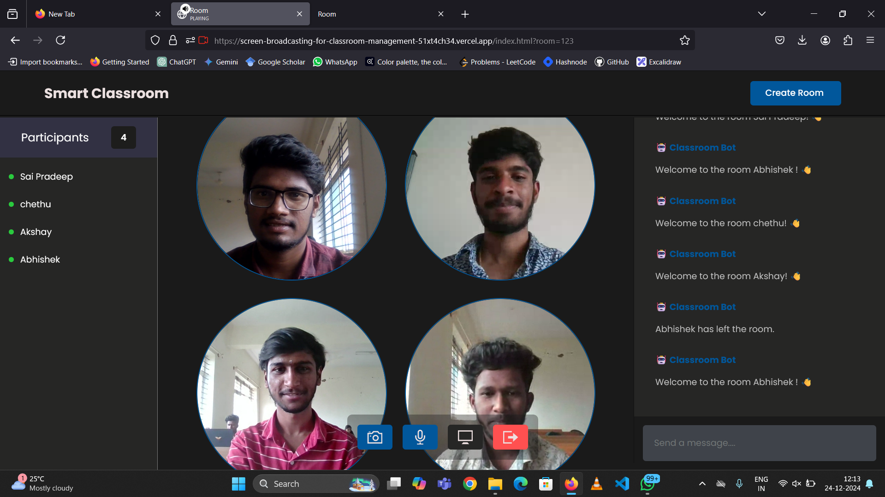
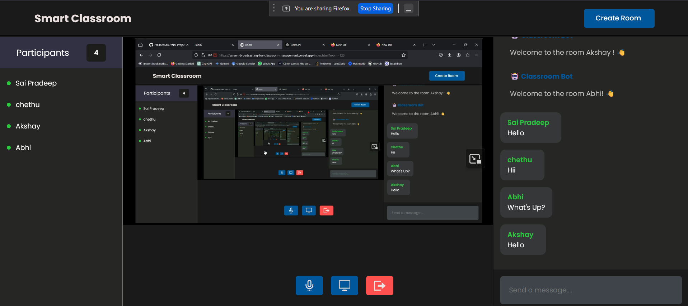
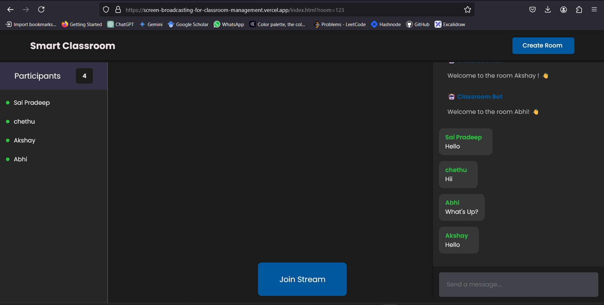

# Screen Broadcasting for Classroom Management

This project enables screen broadcasting for classroom management, where a teacher can share their screen with multiple students in real-time. It uses a simple web-based setup that requires running an index.html file.

### Features

- Screen Sharing: Broadcast the teacher's screen to all students.
- Real-Time Streaming: Seamlessly stream the teacher's content with low latency.
- Classroom-Friendly: Specifically designed for local classroom networks with high-speed connectivity.
- Real-Time-Chat: Students and the teacher can communicate without leaving the browser in real time.

### This is how output looks like
- It has group video calling functionality.

- It has screen sharing functionality.

- It has real time chatting functionality.
